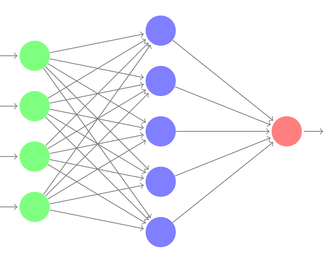
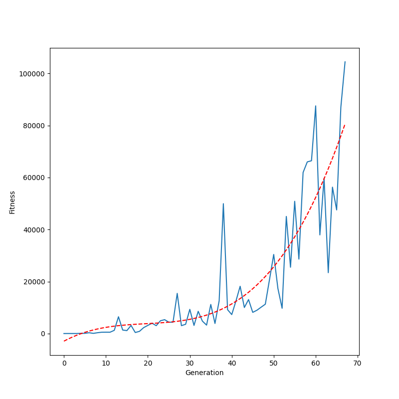

# Flappy Bird with AI
This is a mini group project for course WID3009 Artificial Intelligence Game Programming. The AI method used to play
the game is genetic algorithm with neural network, multilayer perceptron (MLP). Base game of the flappy bird is 
cloned from [here](https://github.com/sourabhv/FlapPyBird) which is implemented using PyGame library.

## Project Structure
* `assets`: directory that contains all assets (sprites, audio) for the flappy bird game
* `assignments`: directory that contains individual assignments submissions
* `data`: directory that contains the output of the project

## Installation
Run `conda env create -f conda_env.yml && conda activate ai-flappy` or `pip install -r requirements.txt` to 
install libraries.

## Usage
* Run `python basegame_flappy.py` to run the base game and play with keyboard input
* Run `python gen_alg.py` to run genetic algorithm
    * (Optional) Configure parameters in `gen_alg.py` script:
        1. `FPS`: use higher value for faster simulation, default is 30
        2. `MAX_SCORE`: maximum score as stop condition
        3. `total_models`: total number of models in the gene pool 
        4. `max_generation`: maximum number of generation as stop condition

## Genetic Algorithm
The settings used in the genetic algorithm is as follows:
  * Gene pool size: 50
  * Fitness function is defined as follows:
    * Reward 1 for each pixel travelled horizontally
    * Reward 50 for each pipe passed
    * Penalized by dividing two if the model's bird goes off-screen, hit the ground or is the first n birds to hit a pipe. Value of n is half of pool size
    * Reward by increasing 20% if the model's bird is the last bird standing
  * Parent selection method: roulette wheel selection
  * Parent cross over method: Uniform crossover (each weight value is randomly swapped between two parents)
  * Mutation rate: 0.15 for the first half generations, 0.1 for the second half generations
  * Mutation change: each weight value is either increased or decreased by 0.2

## Model Architecture
The MLP model has 4 inputs, 1 hidden layer with 5 nodes and 1 output node. Each node in the hidden layer uses relu 
activation function while the output node uses sigmoid activation function.

## Model Input
There are 4 inputs to the MLP model:
1. Height of bird
2. Y-velocity of bird
3. Horizontal distance to next pipe
4. Height of next pipe

Each input is scaled to 0 - 1 by dividing each of its maximum value.

## Model Output
The model has 1 output which tells the bird to jump or not. Output has range between 0 and 1 due to sigmoid activation.
If output value is greater than 0.5, then the bird jump, else it does not jump.

## Training Results
In 67 generations, the algorithm reached the maximum score stop condition and the best model achieved a score of 1000.
The whole learning process is recorded [here](https://drive.google.com/file/d/1NAuT_1OBedczvRX1utEVtOEox4ruBcWP/view).
In short, the genetic algorithm can be summarized into 3 phases:

### Phase 1
At the initial phase, all models are randomly initialized and thus perform random actions and does not even pass 
through the first pipe
  

### Phase 2 
After some times, a few models successfully mutate into better models that are able to jump through pipes. These models 
have higher chance to be selected as parents during cross over and the gene pool steadily becomes better at playing the
game.

### Phase 3
At the final phase, every model in the gene pool are able to play the game well achieving scores above 100. The best 
model achieves the maximum score of 1000 and the algorithm stops there.

### Generation vs Fitness Plot
Plot below demonstrate how fitness value improves through generations. The red-dotted line shows the general trend of the fitness
value.

## Course Assignments
All course assignments' submission are under `assignments` folder. 
There are 3 individual assignments in total.
1. [Playing Games: Ms. Pac Man vs Ghost](assignments/assignment_1)
2. [Heuristic Analysis (Game Playing Agent for Isolation)](assignments/assignment_2)
3. [Generating Content: Maze Generation](assignments/assignment_3)
